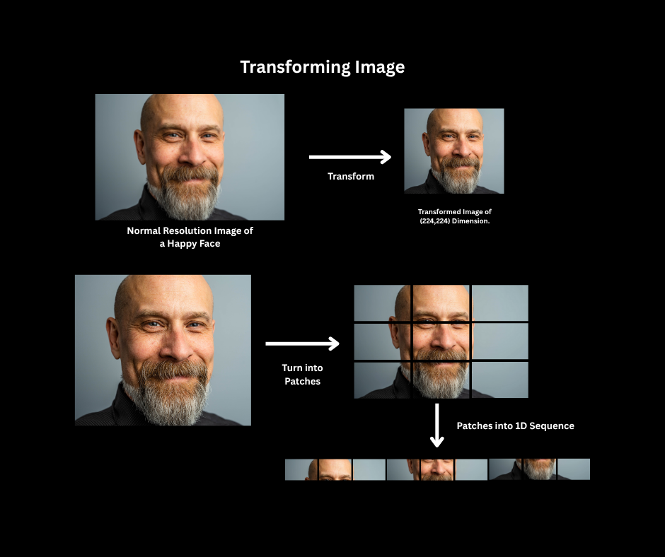
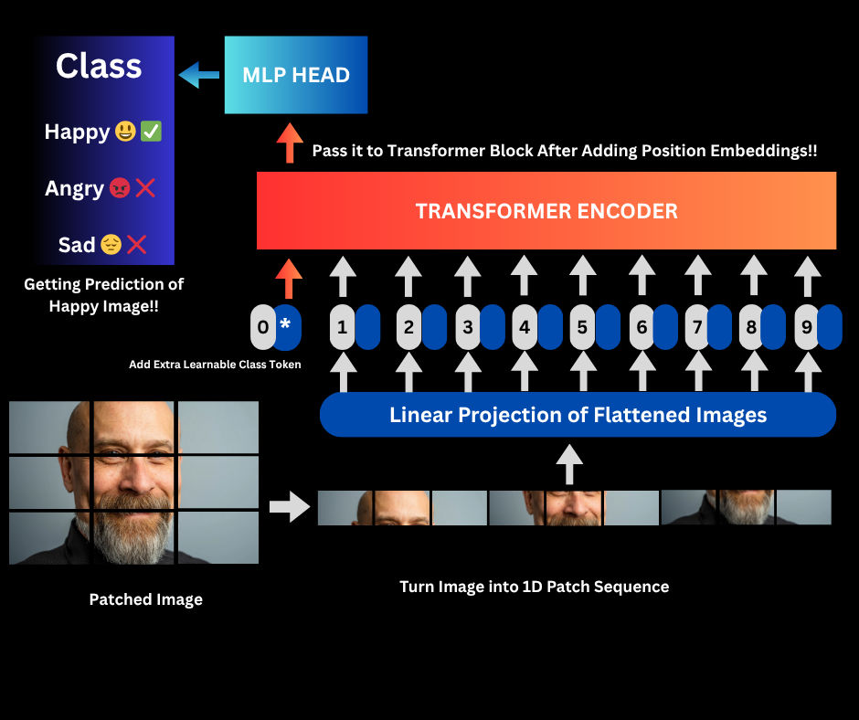

# Replicating-ViT-Research-Paper: Emotion Detection from Facial Images using Vision Transformers🎭📝💻

This is my attempt to replicate the Vision Transformer Paper **"AN IMAGE IS WORTH 16X16 WORDS: TRANSFORMERS FOR IMAGE RECOGNITION AT SCALE"** from scratch using *PyTorch*.

For this project I'm using ViT to classify human emotions (Happy , Angry , Sad). This project is heavily inspired by the Mr. Daniel Bourke's Online Pytorch Course, which helped me in providing foundation and approach for implementing ViT in a modular and scalable way.

**📊 Project Goals**

- ✅ Replicate the Vision Transformer architecture
- ✅ Train a ViT model from scratch
- ✅ Fine-tune a pretrained ViT model
- ✅ Classify human emotions using facial expression images
- ✅ Deploy the final model (coming soon)

**🗂️Repository Structure**

* data/
* going_modular/   #Contains modular functions in .py script file .
    * |---/data_setup.py
    * |---/engine.py
    * |---/helper_function.py
    * |---/image_sampling.py
    * |---/utils.py
* images/          #Contains images explaining equations and figures in ViT Paper , and also images for custom predictions.
* Modular_Functions_For_Pytorch.ipynb          #Notebook explaining the modular functions for pytorch workflow.
* Replicating_The_ViT_Paper_from_Scratch.ipynb      #The main ViT Paper Replication Notebook.

## 📖 Understanding Vision Transformers

### 1. Why Vision Transfomers?
- Traditional Convolutional Neural Networks(CNNS) dominates the computer vision due to their ability to capture local patterns. However, CNNs have limitations in modeling long-range dependencies and lack flexibility. Vision Transformers leverage self-attention to overcome this by treating images like sequences, similar to how NLP models treat sentences.

### 2. Transformers in NLP
- Transformers were originally introduced in the famous paper `Attention is All you Need(2017)` and was originally designed for NLP tasks. They use self-attention to weigh relationships between tokens in a sequence.

### 3. From Words -> Patches to Image -> Patches 
- In the original transformer architecture they break down words into patch embeddings and create sequence and then pass it through the transformer layers , Similarly in ViT we break down a 2-Dimensional picture into patches of equal size (16x16 in this case) and combine them to form a linear sequence and then pass it into transformer layers to classify them. 

I recreated key visuals from the ViT paper to understand how it works under the hood:

- **Figure 1 Explaining the ViT architecture**
  
 
- **Equation 1**
  This equation turns the image into patch embeddings and add an extra learnable token and add position embeddings
  
- **Equation 2&3**
  The Transformer contains the alternating layer of MSA and MLP Blocks , where LayerNorm(LN) is added before and residual connection is added after.
  
  
- **Equation 4**
  [class] Token for Image Classification
  The [class] token output (z₀ᴸ) becomes the image representation y, passed to an MLP (1 hidden layer during pre-training, linear layer during fine-tuning).
  

## Project Workflow in a Nutshell
This project is to replicate the Vision Transformer Architecture and Equations into usable code to classify images to detect the emotion in it (happy, sad , angry).

