# Replicating-ViT-Research-Paper & Plant Leaf Disease Detection using Vision Transformers 🍃🍂🧑‍🔬📝💻

# 1. Project Overview 📝

This project replicates the **Vision Transformer (ViT)** Architecture from the groundbreaking 2020 research paper , "An Image is Worth 16x16 Words" and applies it to plant disease classification.

I replicated a ViT from scratch using PyTorch including patch embedding, transformer encoder layers, and classification head — to deeply understand its mechanics. 

To test the architecture , I trained it on a 3-Class subset of Plant Village Dataset(Tomato Early Blight, Tomato Healthy, Tomato Late Blight). 
Due to the limited dataset size (~500 train / 150 test images per class), the scratch model underfit — mirroring the ViT paper’s emphasis on the need for large-scale pretraining.

Then I fine-tuned a Pre-trained ViT(VIT B-16) on the same dataset , which achieved a strong performance and correctly classified unseen plant disease image I found online.
This confirmed the transfer learning's advantage of pre-trained transformers in low-computation and low-data constraints.

The learnings from this replication will be applied in my upcoming mobile plant disease detection app using a lightweight model for 8+ classes.
 

# 2. Motivation 🏃‍♂️‍➡️📈📖

The ViT paper was a landmark in Computer Vision , that proved Transformer architecture which initially used for NLP can outperform CNNs if you give enough data.

However in real-world domains like Agriculture we don't have millions of labelled images to train from scratch.

By replicating the ViT from scratch and fine-tune a pretrained ViT from scratch on a small-scale agriculture dataset , I aimed for:

- Understand every components , equations and math behind the VIT architecture by building it myself.
- Compare the custom ViT I built vs Transfer Learning Performance.
- Highlight The data requirements of ViT for High Accuracy.
- Prepare for Deploying the model trained using Transfer Learning for Real World use.

This project blends both research paper replication with practical application development, demostrating both theoretical depth and deployement-focused thinking.

# 3. Dataset 📊📚

The dataset is derived from **PlantVillage** Dataset,  a large-scale collection of plant leaf images used for plant disease detection research.

### Original Dataset Details:
- Classes: 39 (various crop species, multiple disease types, and healthy leaves, plus a “background without leaves” class).
- Total Images: 61,486.
- Augmentation Techniques Applied in Original Dataset:
  * Horizontal & vertical flipping
  * Gamma correction
  * Noise injection
  * PCA color augmentation
  * Rotation
  * Scaling
#### Examples of Classes in the Original Dataset:
- Apple (Scab, Black Rot, Cedar Apple Rust, Healthy)
- Pepper Bell (Bacterial Spot, Healthy)
- Potato (Early Blight, Healthy, Late Blight)
- Tomato (Bacterial Spot, Early Blight, Healthy, Late Blight, and more)
- Plus several other fruit, vegetable, and background categories.
### Classes Used for This Project’s ViT Replication:
For the purpose of replicating the Vision Transformer paper under limited compute and training time constraints, I selected 3 classes from the original dataset:
 - Tomato Early Blight
 - Tomato Healthy
 - Tomato Late Blight
#### Sampling Strategy for This Experiment:
- Training Set: 500 images per class.
- Test Set: 150 images per class.
Balanced sampling ensures equal representation of all classes during training and evaluation.
### 📌 Why Reduce the Dataset?
The primary goal was to replicate the ViT paper’s architecture from scratch and compare it against a pretrained ViT model under a controlled, smaller-scale setup.
Using fewer classes and fewer images allowed faster iteration and debugging without requiring massive GPU resources.

# 4. Methodology ⚙️🧱🏗️

- This project was conducted in two phases : **(A) Replicating ViT Architecture From Scratch.**  and **(B) Fine-tuning Pre-trained ViT for Plant disease classification.**

## A. Vision Transformer (ViT) Replication from Scratch

The goal was to replicate the whole ViT architecture from scratch as closely as possible for image classification. 

- In the original transformer architecture they break down words into patch embeddings and create sequence and then pass it through the transformer layers , Similarly in ViT we break down a 2-Dimensional picture into patches of equal size (16x16 in this case) and combine them to form a linear sequence and then pass it into transformer layers to classify them.

- This research paper contains Figures and Equations  which decribe the ViT architecture as pieces of puzzle and we are here to put all together to form the puzzle. Recreating This will help us to understand the math behind the architecture and how it works under the hood.

- Key steps:
**Patch Extraction** – splitting input images into fixed-size patches and flattening them.
**Linear Projection** – embedding patches into a dense representation.
**Positional Encoding** – adding positional information to embeddings.
**Transformer Encoder** – processing embeddings through stacked encoder blocks consisting of:
   - Multi-Head Self Attention (MHSA)  
   - Add & Norm (residual connections + layer normalization)**
   - Feed-Forward Network (FFN)
   - Add & Norm

- **Figure 1 Explaining the ViT architecture**
  
 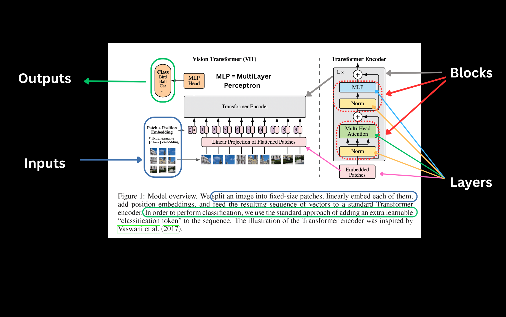
### Equation 1 - Splitting the image into patches and flattening them
**Equation 1 Explaination🧠**
  This equation turns the image into patch embeddings and add an extra learnable token and add position embeddings

  Before the input image can be passed through the Vision Transformer (ViT), it needs to be converted into a sequence format, similar to how words are processed in NLP.

- The input image is split into fixed-size patches (e.g., 16x16).
- Each patch is flattened into a 1D vector.
- A special learnable [CLS] token is prepended to represent the entire image.
- Positional embeddings are added to retain information about the order of patches.

This entire sequence becomes the model's input, just like tokens in a sentence for a language model.
 
  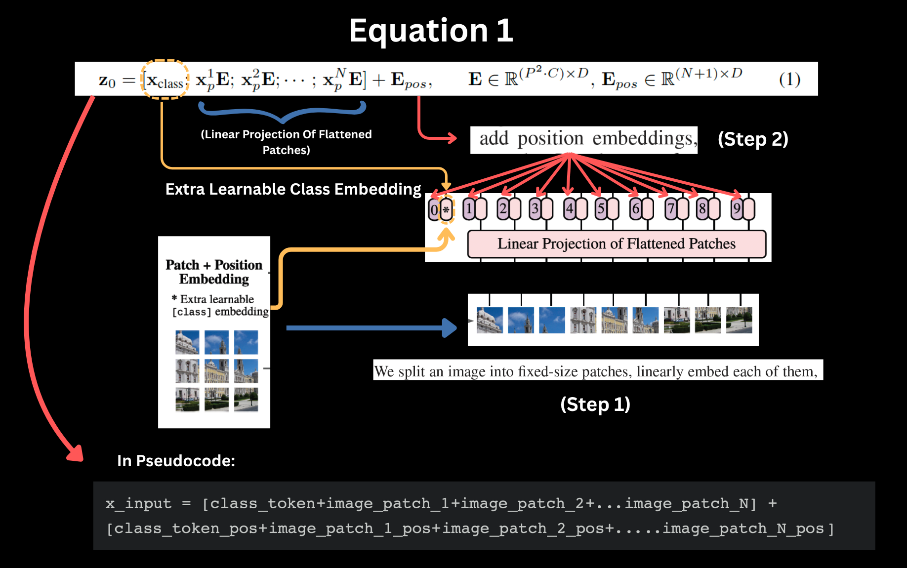
  **Turning Equation 1 into Usable Code**
  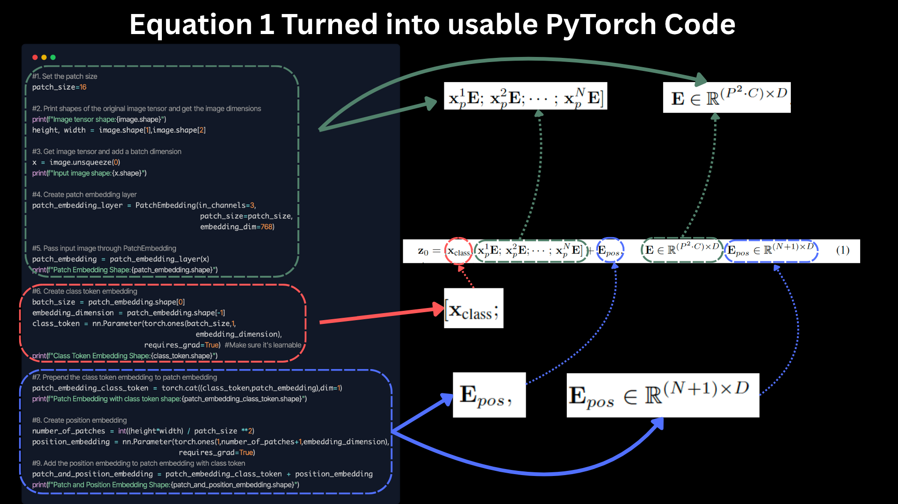
### Equation 2&3
- **Equation 2 Explaination🧠**
After forming the input token sequence from Equation 1, we feed it into a standard Transformer encoder block. The first step in that block is the Multi-Head Self-Attention (MSA) mechanism.
- Each token attends to all other tokens, including itself.
- This helps the model learn relationships between different image patches.
- MSA allows the model to jointly focus on different representation subspaces.
- This is followed by Layer Normalization and a skip connection (residual connection).
  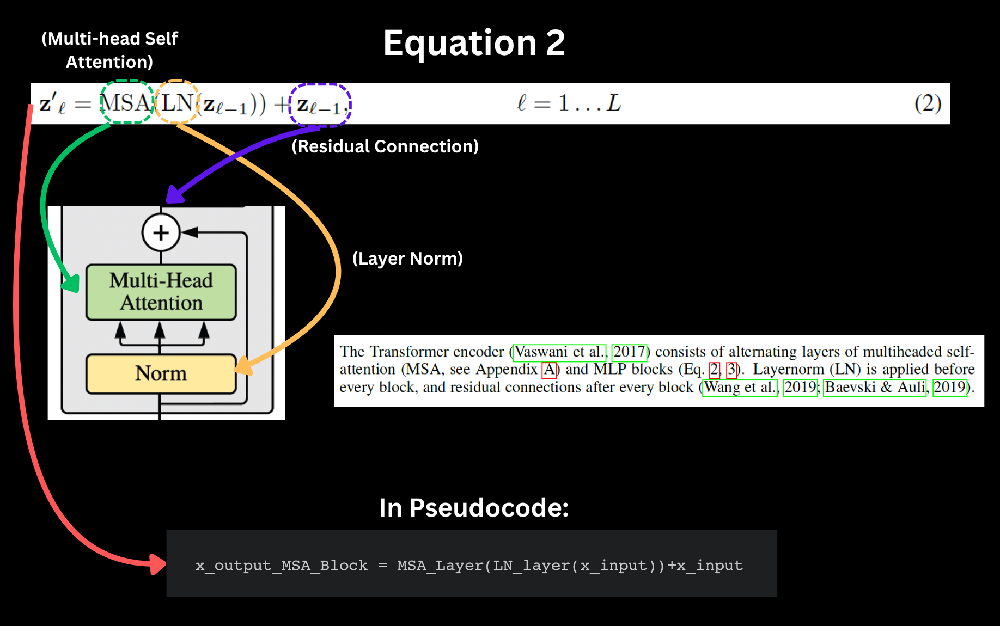
  **Turning Equation 2 into Usable Code**
  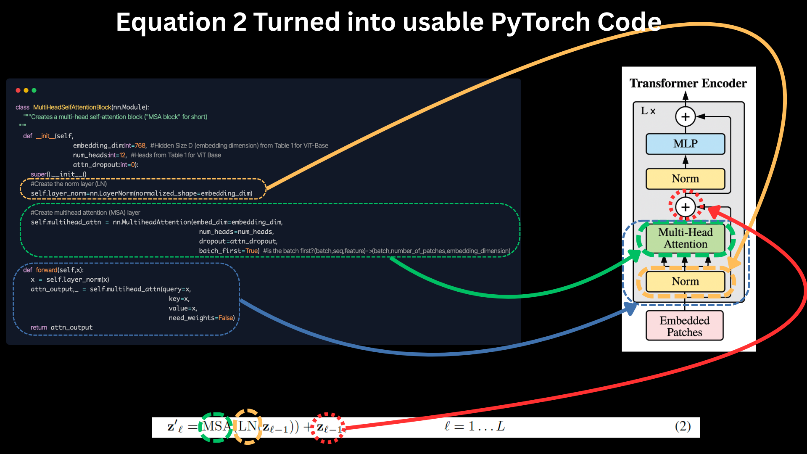
- **Equation 3 Explaination🧠**
- After applying MSA, the result is passed through a position-wise feedforward network — essentially a *2-layer MLP* with a *non-linear activation* (usually GELU or ReLU).
- This helps transform the representations in a more complex way.
- Again, we apply Layer Normalization and a residual connection.
  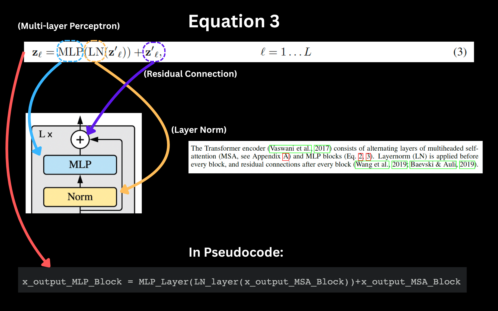
  **Turning Equation 3 into Usable Code**
  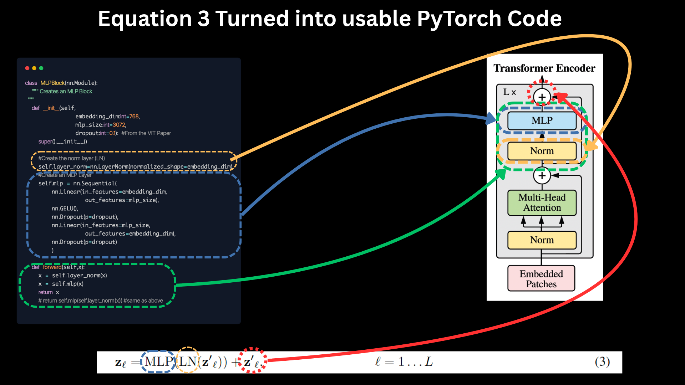
### Equation 4
- **Equation 4 Explaination🧠**
- At the very beginning (Eq. 1), we prepended a special [class] token to the patch embeddings.
- After passing through L Transformer layers, we take the output corresponding to the [class] token (i.e.,z_0^L) as the final image representation.
- This vector now goes through a classification head:
- During pretraining: it's an MLP with one hidden layer.
- During fine-tuning: it's a single linear layer.
- The result is the final logits used for classification (e.g., happy/sad/angry).

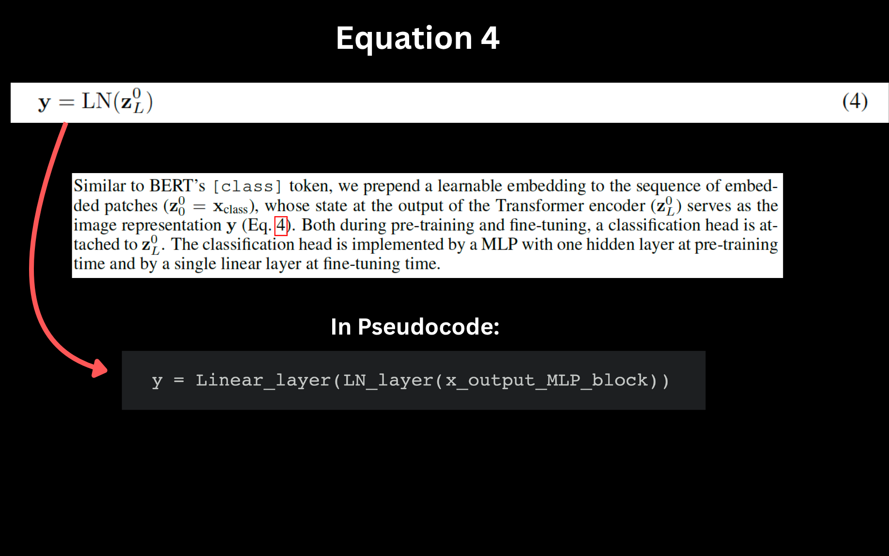

### Table 1 : 

The final piece of the ViT architecture puzzle we'll focus on (for now) is Table 1.

Table 1: Details of Vision Transformer model variants. Source: ViT paper.

| Model | Layers | Hidden size $D$ | MLP size | Heads | Params |
| :--- | :---: | :---: | :---: | :---: | :---: |
| ViT-Base | 12 | 768 | 3072 | 12 | $86M$ |
| ViT-Large | 24 | 1024 | 4096 | 16 | $307M$ |
| ViT-Huge | 32 | 1280 | 5120 | 16 | $632M$ |

This table showcasing the various hyperparameters of each of the ViT architectures.

* ViT-Base , ViT-Large and ViT-Huge are all different sizes of the same model architecture.

* Layers - the number of transformer encoder layers
* Hidden size $D$ - the embedding size throughout the architecture
* MLP size - the number of hidden units/neurons in the MLP
* Head - the number of multi-head self-attention

You can see the numbers gradually increase from ViT-Base to ViT-Huge.

We're going to focus on replicating ViT-Base (start small and scale up when necessary) but we'll be writing code that could easily scale up to the larger variants.

### Putting All together to Form Entire ViT Architecture to Usable PyTorch Code
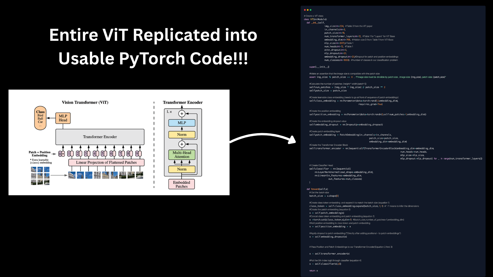
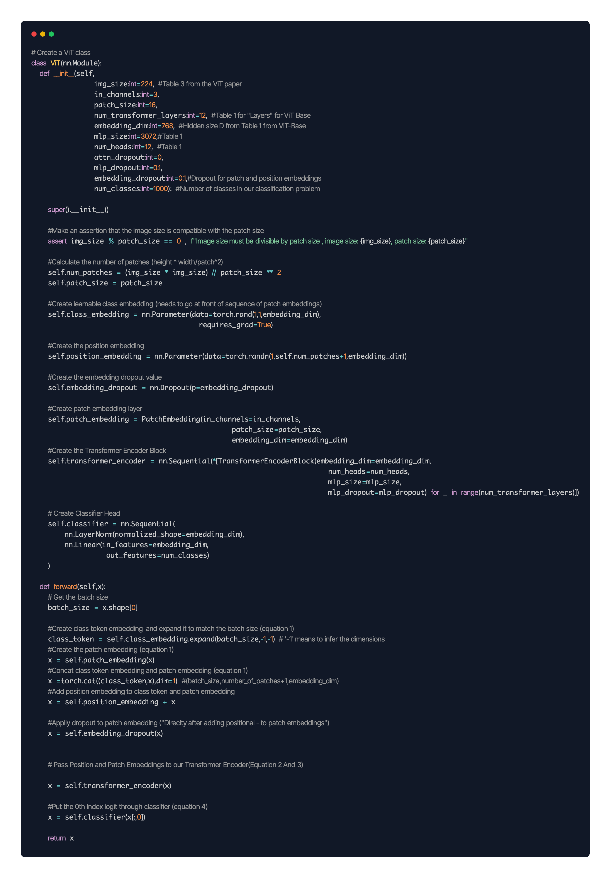

## B. Pretrained ViT Fine-tuning

Given that training from scratch with only ~500 images per class led to underfitting (compared to millions of images in the original paper), I fine-tuned a pretrained ViT model on the same dataset. This significantly improved accuracy and stability in predictions.

## C. Code Structure & Modularity
To ensure the project remains scalable, maintainable, and easy to experiment with, the codebase follows a modular design inspired by Daniel Bourke’s PyTorch workflow:
Separate files for dataset processing, model architecture, training/validation loops, and utility functions.
- Configuration-driven design — key parameters (learning rate, batch size, number of epochs) can be changed in a single config section without altering core logic.
- Reusability — training and evaluation functions are generic enough to be reused across experiments and datasets.
- Ease of debugging — isolated components make troubleshooting straightforward.
This modular approach made it possible to switch between the scratch-built ViT and pretrained ViT with minimal code changes, accelerating iteration speed.

# 5. Results and Evaluation 📈📝

## A. Performance Comparison  

| Model Variant                    | Train Accuracy | Test Accuracy | Train Loss | Test Loss | Observations                                                                                   |
| -------------------------------- | -------------- | ------------- | ---------- | --------- | ---------------------------------------------------------------------------------------------- |
| **ViT (from scratch)**           | 33.79%         | 37.50%        | 1.1173     | 1.1087    | Struggled to converge due to limited data and lack of LR warmup, decay, and gradient clipping. |
| **ViT (pretrained, fine-tuned)** | **98.45%**     | **98.96%**    | 0.0697     | 0.0686    | Achieved near-perfect accuracy thanks to transfer learning from ImageNet weights.              |

## B. Accuracy Progression Over the Epochs 

#### Performance of ViT Built from Scratch 

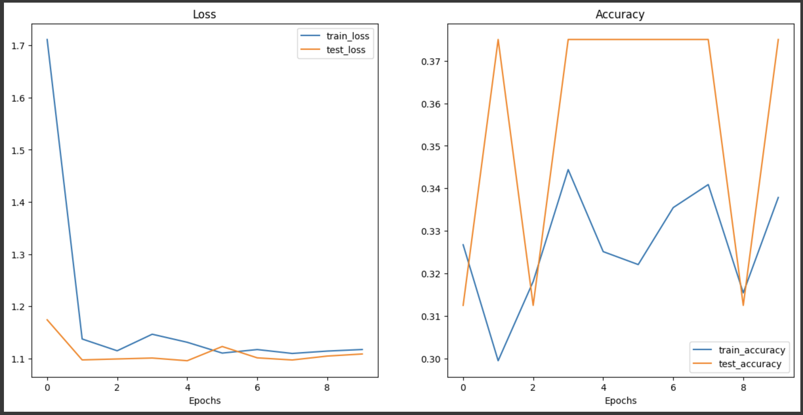

You can see the ViT Built from scratch is not showing promising performance and it looks messy to be honest!!

#### Performance of Pre-trained ViT 
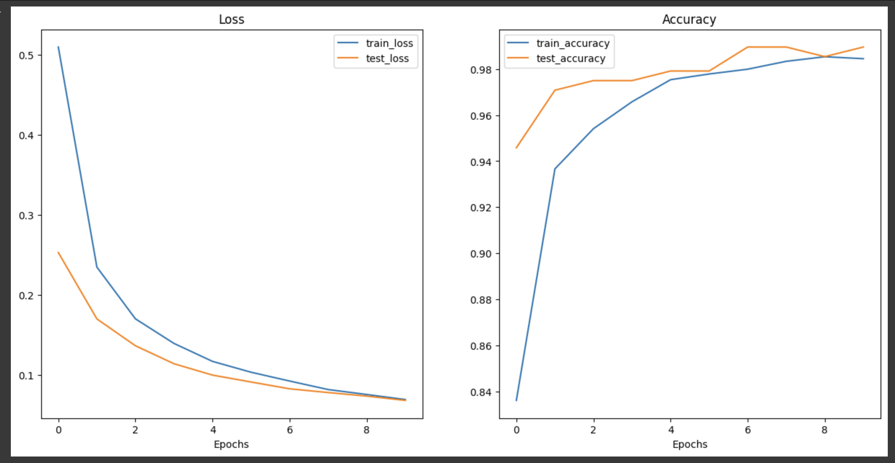

The Pretrained ViT Performance really well , and it looks like the Perfect Loss Curve!!!!🤩👍

### C. Custom Prediction on Images using Pre-Trained ViT 🍃✅

We trained the Model on 3 Classes from Plant Village Dataset , which **Tomato Leaf Early Blight** , **Tomato Leaf Late Blight*** and **Healthy Tomato Leaf**.

I have made custom predictions on the images of the tomato leaves I have found online and it give promising results.

### Actual Label - Tomato Leaf Early Blight | Predicted Correctly with Prediction Probability - 88% ✅
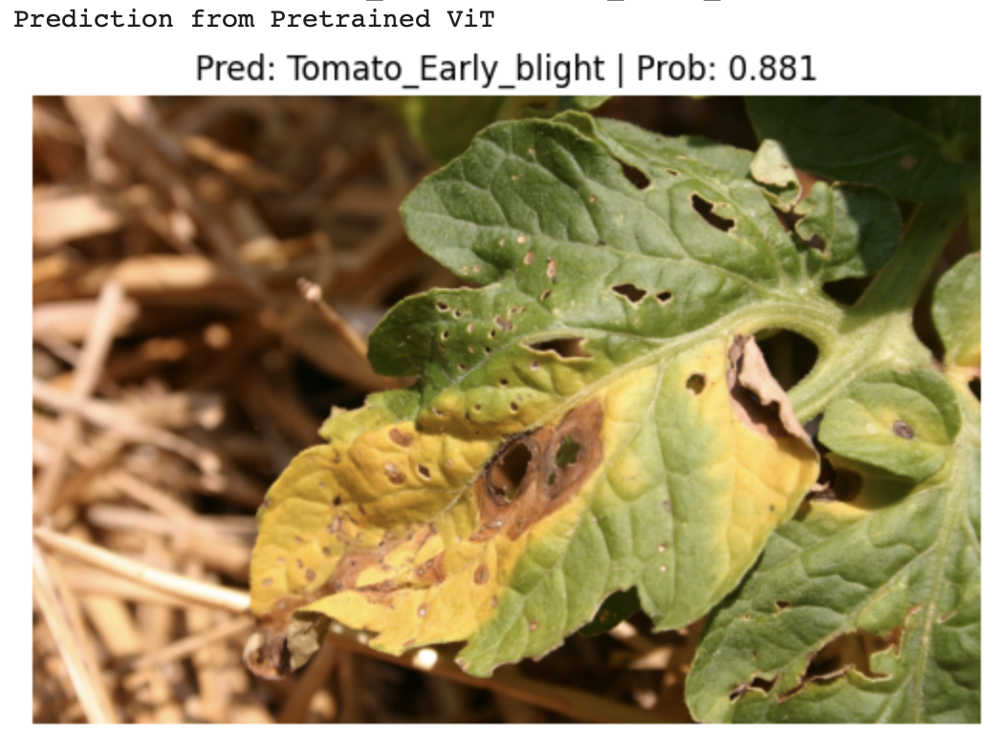

### Actual Label - Tomato Leaf Late Blight | Predicted Correctly with Prediction Probability - 99% ✅
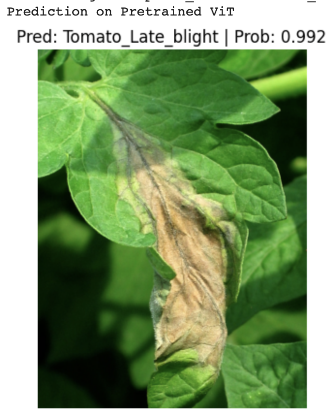

### Actual Label - Healthy Tomato Leaf | Predicted Correctly with Prediction Probability - 98% ✅
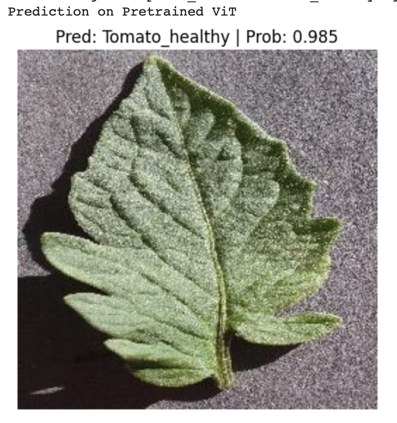

### D. Key Takeaways 🎯

- From Scratch ViT underperformed due to the small scale of Training data and absence of advanced optimization training techniques.
- Fine-tuned Pretrained ViT performed **61% more higher accuracy** on the same training dataset.
- Even with just 3 classes , transfer learning delivers production-ready performance.

### E. Lessons Learned 📖
- Data quantity and quality are crucial for training transformer models from scratch.
- Pretraining + fine-tuning is a game-changer for small datasets.
- Tracking both loss and accuracy per epoch makes model performance easier to interpret and present.

# 6. Deployement and Next Steps 🚀📱

## A. Deployment Plan
The project will be deployed in a way that maximizes accessibility for end-users and demonstrates industry-ready skills:
**1. Model Optimization** 
- Use EfficientNet-B2 for real-time inference.
- Fine-tuned on 8 plant disease classes for lightweight, mobile-friendly performance.
- Apply model quantization to reduce file size and improve latency.
**2.User Interface with Gradio**
- Build a Gradio web app allowing users to upload or capture leaf images.
- Instant predictions with disease name, confidence score, and (planned) basic treatment suggestions.
**3.Hosting on Hugging Face Spaces**
- Deploy the Gradio app directly to Hugging Face Spaces for free public access.
- Allows anyone (including recruiters) to try the model in their browser — no setup required.
- Shareable live demo link for portfolio, resume, and LinkedIn post.

# 7. Conclusion & Key Takeaways 🏁
This project began as a research & replication exercise and evolved into a practical, deployable AI solution.
### Phase 1 — Learning by Building:
I replicated the Vision Transformer (ViT) architecture from scratch to understand the underlying math and mechanisms, including patch embeddings, positional encoding, and multi-head self-attention. While training on a small dataset (~500 images per class) led to underfitting, this phase deepened my transformer intuition.
### Phase 2 — Leveraging Transfer Learning:
I fine-tuned a pretrained ViT on my custom plant disease dataset, achieving ~98.96% test accuracy. This confirmed the power of large-scale pretraining and transfer learning in real-world scenarios.
### Phase 3 — Preparing for Deployment:
To make the solution lightweight and accessible, I am transitioning to EfficientNet-B2, building a Gradio-based interface, and deploying it on Hugging Face Spaces for instant public access.
#### Key Lessons Learned:
Architecture alone isn’t enough — data quantity & quality matter as much as model design.
Pretraining is a game-changer — fine-tuning can drastically outperform training from scratch.
Deployment considerations (latency, model size, user interface) are just as important as accuracy.
#### What’s Next:
Deploy the EfficientNet-B2 + Gradio app on Hugging Face Spaces.
Extend dataset coverage to all 39 classes for broader agricultural use cases.
Integrate a fine-tuned LLM to provide instant, detailed treatment suggestions for detected diseases.

# Acknowledgements🙏

I want to give a special thanks to **Daniel Bourke**, whose PyTorch course was a true game-changer in my journey to master PyTorch and Vision Transformers. Without his clear explanations, practical approach, and modular code style, I wouldn’t have been able to implement and understand the Vision Transformer architecture so effectively. Daniel is truly a hero in my PyTorch learning path, and I highly recommend his course to anyone serious about mastering PyTorch!!.

Course repository - https://github.com/mrdbourke/pytorch-deep-learning/

